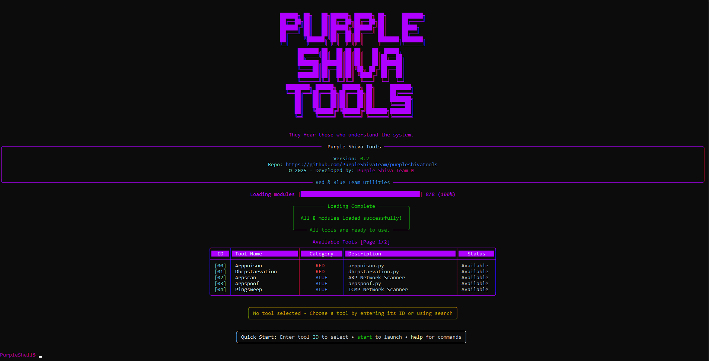
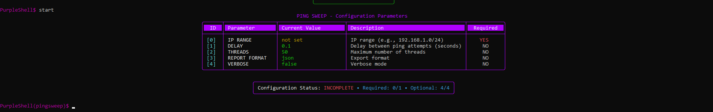

<p align="center">
  
</p>

&nbsp;

# Purple Shiva Tools

Open Source Cybersec toolkit based on **Metasploit** but focused on **network core concepts**.
Built to practice offensive security techniques with clarity and structure.  

Currently I am working only with **Python**, with the goal of expanding to other programming languages in the future.

&nbsp;

- Developed by: **Gianluca Nunes** + *Contributors*

&nbsp;

# ❗ PROJECT UNDER DEVELOPMENT ❗

This project is currently under development.  
This repository will be updated as the project progresses.

**Current version: Alpha V0.3**

&nbsp;

# MAIN TOOLS

## Reconnaissance
- **arpscan** → Scan active hosts on the local network  
- **arpspoof mitm** → ARP spoofing for Man-in-the-Middle attacks  
- **pingsweep** → ICMP ping sweep to map live hosts  
- **portscan** → Discover open ports on target systems  
- **smbenum** → Enumerate SMB shares and services  
- **vulnservices** → Identify vulnerable services on discovered hosts  

## Denial of Service (DoS)
- **arppoison** → ARP cache poisoning attack  
- **dhcpstarvation** → Exhaust DHCP pool to deny IP allocation  
- **dnsflood** → Flood a DNS server with requests  

## Features
- **Search** → Search for tools by name in an interactive shell  
- **Manual** → Detailed manual for all tools included  
- **Terminal Mode** → Run tools using commands, directly from the Linux shell

&nbsp;

# SCREENSHOTS

<p align="center">
  
  
</p>

&nbsp;

# HOW TO INSTALL IT

Clone the repository (alpha branch) and access the content:  
```bash
git clone --branch alpha https://github.com/PurpleShivaTeam/purpleshivatools.git
cd /purpleshivatools/src/alpha/v0_3/
```

Install requirements (only tested on Kali Linux 2025):
```bash
pip install -r requirements.txt --break-system-packages
```

Launching the tool:
```bash
python3 bootstrap.py
```

# ⚠️ REMEMBER: ONLY USE PURPLE SHIVA TOOLS ON AUTHORIZED ENVIRONMENTS! ⚠️